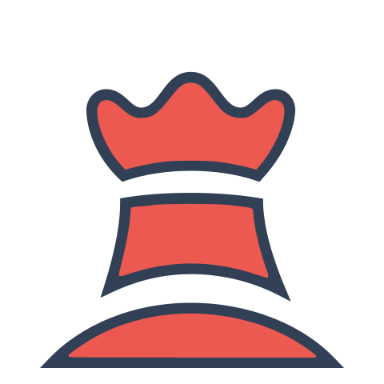
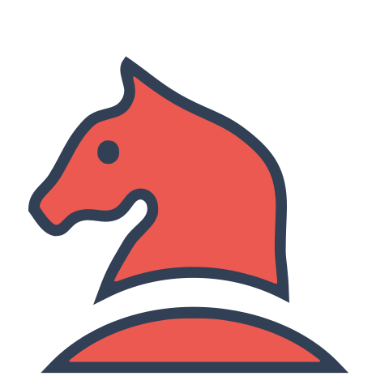
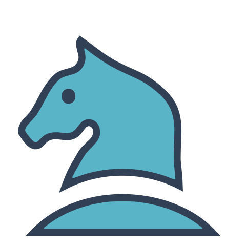
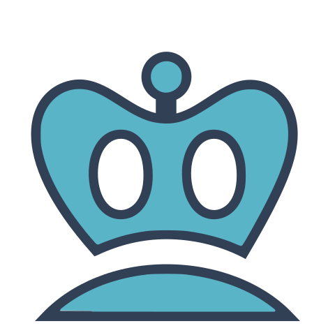
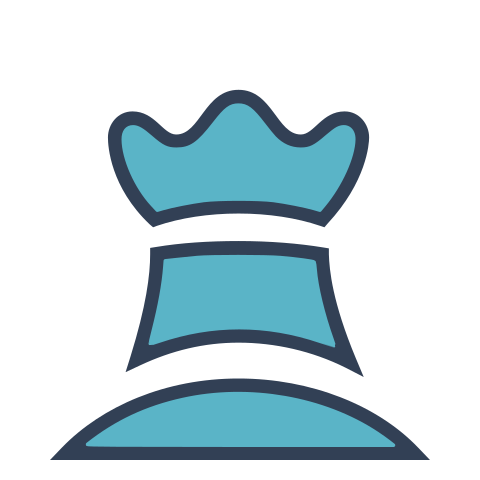

  

# About Me
> **Reach out: [Website](https://camdan.me) | [YouTube](https://youtube.com/@camdan-me) | [Discord](https://discord.com/users/564859369951461406) | [Email](mailto:hello@camdan.me)**

I'm a multitalented student who likes coding, storytelling, and music with a real knack for problem solving. Check me out across the internet!

# Chess
**Ever wanted to play an open chess tournament with random strangers across the internet? Well, today is your lucky day! It's currently <!-- BEGIN TURN -->blue<!-- END TURN -->'s turn. Scroll down to play!**

<!-- BEGIN CHESS BOARD -->
|   | A | B | C | D | E | F | G | H |   |
|---|:-:|:-:|:-:|:-:|:-:|:-:|:-:|:-:|:-:|
| **8** |  |  |  |  |  |  |  |  | **8** |
| **7** |  |  |  |  |  |  |  |  | **7** |
| **6** |  |  |  |  |  |  |  |  | **6** |
| **5** |  |  |  |  |  |  |  |  | **5** |
| **4** |  |  |  |  |  |  |  |  | **4** |
| **3** |  |  |  |  |  |  |  |  | **3** |
| **2** |  |  |  |  |  |  |  |  | **2** |
| **1** |  |  |  |  |  |  |  |  | **1** |
|   | **A** | **B** | **C** | **D** | **E** | **F** | **G** | **H** |   |
<!-- END CHESS BOARD -->

## Instructions
**Choose a move from the table below. To make a move, click a link and then submit the issue without changing anything!**
<!-- BEGIN MOVES LIST -->
|  FROM  | TO |
| :----: | :---------------------- |
| **A2** | [A3](https://github.com/camdan-me/camdan-me/issues/new?body=Don%27t+touch+the+title.+Just+submit+the+issue.&title=Chess%3A+Move+A2+to+A3) |
| **D1** | [A1](https://github.com/camdan-me/camdan-me/issues/new?body=Don%27t+touch+the+title.+Just+submit+the+issue.&title=Chess%3A+Move+D1+to+A1), [B1](https://github.com/camdan-me/camdan-me/issues/new?body=Don%27t+touch+the+title.+Just+submit+the+issue.&title=Chess%3A+Move+D1+to+B1), [B3](https://github.com/camdan-me/camdan-me/issues/new?body=Don%27t+touch+the+title.+Just+submit+the+issue.&title=Chess%3A+Move+D1+to+B3), [C1](https://github.com/camdan-me/camdan-me/issues/new?body=Don%27t+touch+the+title.+Just+submit+the+issue.&title=Chess%3A+Move+D1+to+C1), [C2](https://github.com/camdan-me/camdan-me/issues/new?body=Don%27t+touch+the+title.+Just+submit+the+issue.&title=Chess%3A+Move+D1+to+C2), [D2](https://github.com/camdan-me/camdan-me/issues/new?body=Don%27t+touch+the+title.+Just+submit+the+issue.&title=Chess%3A+Move+D1+to+D2), [D3](https://github.com/camdan-me/camdan-me/issues/new?body=Don%27t+touch+the+title.+Just+submit+the+issue.&title=Chess%3A+Move+D1+to+D3), [D4](https://github.com/camdan-me/camdan-me/issues/new?body=Don%27t+touch+the+title.+Just+submit+the+issue.&title=Chess%3A+Move+D1+to+D4), [D5](https://github.com/camdan-me/camdan-me/issues/new?body=Don%27t+touch+the+title.+Just+submit+the+issue.&title=Chess%3A+Move+D1+to+D5), [D6](https://github.com/camdan-me/camdan-me/issues/new?body=Don%27t+touch+the+title.+Just+submit+the+issue.&title=Chess%3A+Move+D1+to+D6), [D7](https://github.com/camdan-me/camdan-me/issues/new?body=Don%27t+touch+the+title.+Just+submit+the+issue.&title=Chess%3A+Move+D1+to+D7), [E1](https://github.com/camdan-me/camdan-me/issues/new?body=Don%27t+touch+the+title.+Just+submit+the+issue.&title=Chess%3A+Move+D1+to+E1) |
| **E2** | [C1](https://github.com/camdan-me/camdan-me/issues/new?body=Don%27t+touch+the+title.+Just+submit+the+issue.&title=Chess%3A+Move+E2+to+C1), [C3](https://github.com/camdan-me/camdan-me/issues/new?body=Don%27t+touch+the+title.+Just+submit+the+issue.&title=Chess%3A+Move+E2+to+C3), [D4](https://github.com/camdan-me/camdan-me/issues/new?body=Don%27t+touch+the+title.+Just+submit+the+issue.&title=Chess%3A+Move+E2+to+D4), [F4](https://github.com/camdan-me/camdan-me/issues/new?body=Don%27t+touch+the+title.+Just+submit+the+issue.&title=Chess%3A+Move+E2+to+F4), [G1](https://github.com/camdan-me/camdan-me/issues/new?body=Don%27t+touch+the+title.+Just+submit+the+issue.&title=Chess%3A+Move+E2+to+G1), [G3](https://github.com/camdan-me/camdan-me/issues/new?body=Don%27t+touch+the+title.+Just+submit+the+issue.&title=Chess%3A+Move+E2+to+G3) |
| **F1** | [G1](https://github.com/camdan-me/camdan-me/issues/new?body=Don%27t+touch+the+title.+Just+submit+the+issue.&title=Chess%3A+Move+F1+to+G1) |
| **F2** | [F3](https://github.com/camdan-me/camdan-me/issues/new?body=Don%27t+touch+the+title.+Just+submit+the+issue.&title=Chess%3A+Move+F2+to+F3), [F4](https://github.com/camdan-me/camdan-me/issues/new?body=Don%27t+touch+the+title.+Just+submit+the+issue.&title=Chess%3A+Move+F2+to+F4) |
| **G2** | [G3](https://github.com/camdan-me/camdan-me/issues/new?body=Don%27t+touch+the+title.+Just+submit+the+issue.&title=Chess%3A+Move+G2+to+G3), [G4](https://github.com/camdan-me/camdan-me/issues/new?body=Don%27t+touch+the+title.+Just+submit+the+issue.&title=Chess%3A+Move+G2+to+G4) |
| **H1** | [G1](https://github.com/camdan-me/camdan-me/issues/new?body=Don%27t+touch+the+title.+Just+submit+the+issue.&title=Chess%3A+Move+H1+to+G1) |
| **H2** | [H3](https://github.com/camdan-me/camdan-me/issues/new?body=Don%27t+touch+the+title.+Just+submit+the+issue.&title=Chess%3A+Move+H2+to+H3), [H4](https://github.com/camdan-me/camdan-me/issues/new?body=Don%27t+touch+the+title.+Just+submit+the+issue.&title=Chess%3A+Move+H2+to+H4) |
<!-- END MOVES LIST -->

## Fun Stats

  
Previous moves in this game

<!-- BEGIN LAST MOVES -->

| Move | Author |
| :--: | :----- |
| `B8` to `C6` | [ @Alrmendo](https://github.com/Alrmendo) |
| `C1` to `E2` | [ @403Denied](https://github.com/403Denied) |
| `E5` to `C3` | [ @camdan-me](https://github.com/camdan-me) |
| `B1` to `C3` | [ @Techpro709](https://github.com/Techpro709) |
| `B7` to `B6` | [ @ajs256](https://github.com/ajs256) |
| `E2` to `C1` | [ @camdan-me](https://github.com/camdan-me) |
| `B2` to `E5` | [ @KonnorDev](https://github.com/KonnorDev) |
| `A3` to `A4` | [ @alx-alexpark](https://github.com/alx-alexpark) |
| `E8` to `G8` | [ @Captainexpo-1](https://github.com/Captainexpo-1) |
| `D4` to `E5` | [ @faisalsayed10](https://github.com/faisalsayed10) |
| `A1` to `B2` | [ @bellesea](https://github.com/bellesea) |
| `D3` to `D4` | [ @OptimalBlock489](https://github.com/OptimalBlock489) |
| `A7` to `A5` | [ @zachlatta](https://github.com/zachlatta) |
| `C1` to `B2` | [ @camdan-me](https://github.com/camdan-me) |
| `D4` to `A1` | [ @jasonisrailov](https://github.com/jasonisrailov) |
| `G1` to `E2` | [ @polypixeldev](https://github.com/polypixeldev) |
| `C4` to `D4` | [ @jasonisrailov](https://github.com/jasonisrailov) |
| `D2` to `D3` | [ @camdan-me](https://github.com/camdan-me) |
| `E4` to `C4` | [ @jasonisrailov](https://github.com/jasonisrailov) |
| `E1` to `F1` | [ @camdan-me](https://github.com/camdan-me) |
| `H4` to `E4` | [ @leonardos4enz](https://github.com/leonardos4enz) |
| `D3` to `E4` | [ @camdan-me](https://github.com/camdan-me) |
| `D8` to `H4` | [ @berkaybarisalgun](https://github.com/berkaybarisalgun) |
| `E2` to `D3` | [ @camdan-me](https://github.com/camdan-me) |
| `F6` to `E4` | [ @CreativeGit](https://github.com/CreativeGit) |
| `B2` to `A3` | [ @camdan-me](https://github.com/camdan-me) |
| `F8` to `A3` | [ @KAJdev](https://github.com/KAJdev) |
| `C2` to `C4` | [ @bremea](https://github.com/bremea) |
| `G8` to `F6` | [ @camdan-me](https://github.com/camdan-me) |
| `F1` to `E2` | [ @reesericci](https://github.com/reesericci) |
| `E7` to `E5` | [ @l3gacyb3ta](https://github.com/l3gacyb3ta) |
| `E2` to `E4` | [ @camdan-me](https://github.com/camdan-me) |
| `Start game` | [ @camdan-me](https://github.com/camdan-me) |

<!-- END LAST MOVES -->

  
Top 10 players

<!-- BEGIN TOP MOVES -->

| Total moves |  User  |
| :---------: | :----- |
| 10 | [@camdan-me](https://github.com/camdan-me) |
| 3 | [@jasonisrailov](https://github.com/jasonisrailov) |
| 1 | [@l3gacyb3ta](https://github.com/l3gacyb3ta) |
| 1 | [@reesericci](https://github.com/reesericci) |
| 1 | [@bremea](https://github.com/bremea) |
| 1 | [@KAJdev](https://github.com/KAJdev) |
| 1 | [@CreativeGit](https://github.com/CreativeGit) |
| 1 | [@berkaybarisalgun](https://github.com/berkaybarisalgun) |
| 1 | [@leonardos4enz](https://github.com/leonardos4enz) |
| 1 | [@polypixeldev](https://github.com/polypixeldev) |

<!-- END TOP MOVES -->

This game runs on a modified version of [marcizhu/readme-chess](https://github.com/marcizhu/readme-chess)! Go check out the original project.

---

